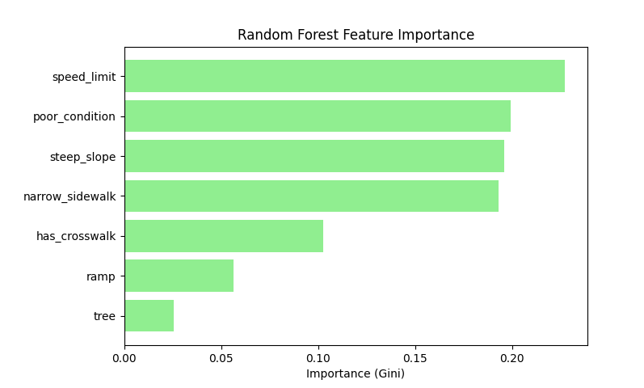
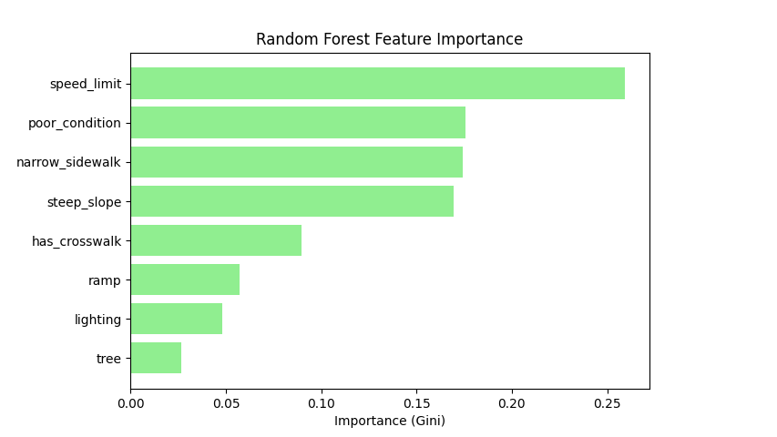

# NavigAid-model

Data pipeline and machine-learning models behind [NavigAid](https://github.com/Rayna-Yu/NavigAid), an experimental research proejct for a pedestrian navigation app in Boston. The models estimate the probability of a vehicle-pedestrian crash at a location from nearby street-level infrastructure.

Paper: *NavigAid: A Route Analysis and Navigation Model for Pedestrian Safety Using Random Forest Algorithm* 

## Approach

- **Task:** binary classification of whether a sampled point had a pedestrian crash within 10 m. Day and night are modeled separately, and the night model adds streetlights.
- **Sampling:** 300k points from the OSMnx Boston walking network. Crash and no-crash classes are balanced by undersampling (41,810 day rows, 18,764 night rows).
- **Features** (counted or measured within 10 m, from [Analyze Boston](https://data.boston.gov/) data):

  | Feature | Source |
  | --- | --- |
  | Speed limit (proxy for impact speed) | Street Segments |
  | Sidewalk width, slope, damaged-area ratio | Sidewalk Inventory |
  | Crosswalk coverage | Sidewalk Centerline |
  | Curb ramps | Pedestrian Ramp Inventory |
  | Street trees | BPRD Trees |
  | Streetlights (night only) | Streetlight Locations |
  | Crash labels | Vision Zero |

- **Model:** scikit-learn `RandomForestClassifier` (300 trees, `random_state=42`) with isotonic calibration on a held-out calibration split, so `predict_proba` outputs can be used as crash probabilities. Split: 80/20 train/hold-out, then 80/20 base/calibration within train.
- **Other models compared:** logistic regression (plain, degree-2, lasso), SVM, and gradient boosting.

## Results (random hold-out split, class-balanced)

- Speed limit is the strongest predictor in both models, matching prior crash research. Sidewalk condition, slope, and width follow close behind. Crosswalk coverage also contributes positively to predicted risk, likely because it reflects pedestrian exposure.
- Ramps, lighting, and tree coverage have the smallest effects.

### Feature importance

| Day | Night |
| --- | --- |
|  |  |

Gini importance from the random forest.

### Metrics

Hold-out metrics (random split, so likely optimistic):

| | Day | Night |
| --- | --- | --- |
| Accuracy | 0.965 | 0.969 |
| ROC AUC | 0.991 | 0.994 |
| Brier score (uncalibrated → calibrated) | 0.043 → 0.024 | 0.044 → 0.028 |

### Limitations

- Metrics are on balanced data, so they may not reflect real-world crash base rates.
- The hold-out is a random split, so nearby points with near-identical features can land in both train and test. Spatial cross-validation is future work.

Other plots (ROC, calibration, confusion matrices, learning curves, partial dependence, etc.) are in [`results/`](results/) and discussed in the paper.

## Repo layout

```
model/
  preprocess/   generate_points.py → filter_boston_crash_data.py → compile_data.py
                (feature_engineering.py, geo_helpers.py are shared helpers)
  models/       random_forest.py plus the comparison models
  utils/        plotting and model helpers
  datasets/     raw city data, sampled points, and the compiled day/night CSVs
final/          trained calibrated models (*.pkl, gitignored)
```

## Reproduce

Run everything from the repo root (scripts use relative paths).

```bash
pip install pandas numpy geopandas osmnx shapely scikit-learn shap matplotlib seaborn joblib
python model/preprocess/generate_points.py        # sample Boston walking network
python model/preprocess/filter_boston_crash_data.py
python model/preprocess/compile_data.py           # build day/night CSVs
python model/models/random_forest.py              # train, calibrate, evaluate, save to final/
```

The compiled CSVs are already in `model/datasets/final_csv/`, so you can skip straight to training. The paper used Python 3.12.7 and scikit-learn 1.5.2; use the same scikit-learn version when loading saved models, since pickles are version sensitive.

## Using the models in the app

Copy the trained models to the app repo as `app/backend/models/day_model.pkl` and `night_model.pkl`. The backend averages per-point probabilities along a route to score it.
